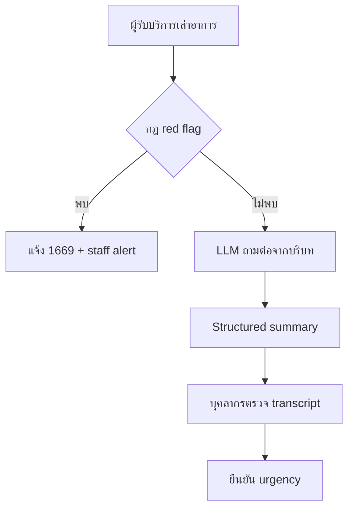

# Pitch + Pilot Plan: หมอพร้อมคุย

## คำตัดสินตรง ๆ

ไอเดียนี้ “ฟังดูดีและมีโอกาสชนะ” เมื่อเล่าเป็น **AI pre-visit intake ที่คืนเวลาให้บุคลากรและไม่แทนแพทย์** ไม่ควรขายด้วยประโยคว่า LLM “เข้าใจชีววิทยาอย่างลึกซึ้ง” หรือ “วินิจฉัยได้” เพราะเป็น claim ที่เสี่ยงและพิสูจน์ยาก

ประโยคเปิดที่แนะนำ:

> หมอพร้อมคุยช่วยซักประวัติซ้ำ ๆ ก่อนเข้าห้องตรวจ ตรวจสัญญาณอันตรายด้วยกฎที่บุคลากรรับรอง และให้ LLM ถามต่อจากบริบทเพื่อสร้างสรุปที่แพทย์ตรวจย้อนกลับถึงคำพูดต้นฉบับได้

## กลุ่มเป้าหมายที่เจ็บจริง

**Beachhead:** คลินิกเวชกรรมทั่วไป/คลินิกเฉพาะทางขนาดเล็กถึงกลางที่มี 30–150 visits/วัน, แพทย์ 1–5 คน, ผู้ป่วย walk-in หนาแน่นช่วงเช้า และยังซักประวัติซ้ำด้วยกระดาษหรือแชต

| บทบาท | Pain | คุณค่าที่ได้รับ |
| --- | --- | --- |
| แพทย์เจ้าของคลินิก (ผู้ซื้อ) | เวลาในห้องตรวจถูกใช้กับคำถามพื้นฐาน | อ่านสรุปก่อนพบและเห็น transcript |
| พยาบาล/ผู้ช่วย (ผู้ใช้หลัก) | ซักข้อมูลเดิมหลายรอบ คิวหน้าเคาน์เตอร์แน่น | เห็นเคสพร้อมข้อมูลและเคสที่ต้องตรวจเร็ว |
| ผู้รับบริการ | ต้องเล่าซ้ำและไม่รู้ว่าควรบอกอะไร | เล่าอาการตามจังหวะตัวเองก่อนพบแพทย์ |

“ต้องการจริง” ยังเป็นสมมติฐานจนกว่าจะมีหลักฐาน แผนที่ควรทำภายใน 7 วันคือสัมภาษณ์ 10 คลินิก, ขอ LOI 3 แห่ง และหา design partner 1 แห่ง

## Core flow ที่แสดงว่า LLM จำเป็น

หากเอา LLM ออก ระบบยังทำ form คงที่ได้ แต่จะเสียการถามต่อที่ปรับตามบริบท การจัดภาษาไม่เป็นโครงสร้างให้เป็น summary และการติดตามข้อมูลที่ยังขาด นี่คือคุณค่าหลักที่พิสูจน์ได้โดยไม่อ้างว่า AI เป็นแพทย์

## ทำไมยังไม่ใส่ RAG ใน MVP

RAG ไม่ได้ทำให้ข้อมูลถูกโดยอัตโนมัติ และฐานความรู้ทางการแพทย์ต้องมีเจ้าของเนื้อหา เวอร์ชัน วันที่ทบทวน และ clinical sign-off สำหรับ hackathon ให้โชว์ protocol แบบ versioned + deterministic red flags ก่อน หลังได้ design partner จึงเพิ่ม retrieval เฉพาะเอกสารของคลินิกที่อนุมัติแล้ว พร้อมแสดง source/version ทุกครั้ง

## เดโม 3 นาที

1. **0:00–0:25 Pain:** ผู้ป่วย 60 คน/เช้า ผู้ช่วยถามซ้ำ แพทย์เริ่มจากศูนย์
2. **0:25–1:15 Normal flow:** กรอก “ปวดท้องตั้งแต่เมื่อคืน” → AI ถามเวลาเริ่ม ความรุนแรง อาการร่วม → เปิด staff summary
3. **1:15–1:45 Safety flow:** กรอก “เจ็บแน่นหน้าอกและหายใจไม่ออก” → rule engine หยุด AI และแสดง 1669
4. **1:45–2:15 Human oversight:** แพทย์เปิด transcript เปรียบเทียบสรุป และกดยืนยัน urgency
5. **2:15–2:40 Technical:** server ของทีม, HTTPS, PostgreSQL, Structured Outputs, audit, fallback, tests
6. **2:40–3:00 Pilot:** 1 คลินิก 2 สัปดาห์ วัดเวลาซักประวัติ ความครบถ้วน และ safety misses

## KPI ของ pilot 2 สัปดาห์

| KPI | วิธีวัด | เป้าหมายเริ่มต้น (สมมติฐาน) |
| --- | --- | --- |
| เวลาซักประวัติที่เคาน์เตอร์ | median ก่อน/หลัง | ลด ≥30% |
| ความครบถ้วน | checklist ที่ clinician ให้คะแนน | ≥85% |
| Clinical edit rate | ช่องสรุปที่ต้องแก้ | <20% |
| Emergency false negative | ชุดทดสอบที่อนุมัติ | 0 |
| ผู้ป่วยทำสำเร็จ | started → ready | ≥70% |
| ความพึงพอใจบุคลากร | 1–5 | ≥4.0 |

ตัวเลขเหล่านี้เป็นเกณฑ์ทดลอง ไม่ใช่ผลลัพธ์ที่มีแล้ว ห้ามนำไปพูดว่าเป็น performance ของผลิตภัณฑ์ก่อนวัดจริง

## Go-to-market ที่เร็วที่สุด

1. หา design partner จากคลินิกที่เจ้าของเป็นผู้ใช้งานเอง ตัดวงจรจัดซื้อยาว
2. เริ่มด้วย QR ที่หน้าคลินิก/ลิงก์ก่อนมา ไม่เชื่อม HIS ในรอบแรก
3. ขายผลลัพธ์เป็นเวลาที่คืนให้บุคลากร ไม่ขาย “AI วินิจฉัย”
4. หลัง pilot เสนอค่าบริการรายคลินิกต่อเดือน โดยตั้งราคาเมื่อรู้ willingness-to-pay จริง
5. หลักฐานการซื้อที่กรรมการเชื่อ: LOI, นัด pilot, baseline time study และคำพูดลูกค้า—not market-size slide เพียงอย่างเดียว

## Business model hypothesis

- Starter: ต่อคลินิก/เดือน จำกัดจำนวนเคส
- Growth: หลายสาขา, role-based access, export/integration
- Enterprise: private deployment, SSO, audit/compliance, SLA

อย่ากำหนดราคาสุดท้ายก่อนสัมภาษณ์ผู้ซื้ออย่างน้อย 10 ราย ใช้คำถาม “หากลดเวลาซักประวัติได้ X นาที/เคส คุณจ่ายเท่าไร” และทดสอบราคา 3 ระดับ

## คำถามกรรมการที่ต้องตอบให้ได้

- **ถ้า AI ผิด?** แสดง transcript, structured schema, output guard, safe fallback และ clinician confirmation
- **ถ้าพบเหตุฉุกเฉิน?** deterministic rule ทำงานก่อน AI และแสดง 1669
- **ทำไมไม่ใช้ Google Form?** Form ถามเหมือนกันทุกคน; LLM เลือกคำถามต่อจากบริบทและสรุปข้อมูลไม่เป็นโครงสร้าง
- **ข้อมูลสุขภาพไปไหน?** HTTPS, PostgreSQL บน infra ทีม, ไม่มี direct identifier ใน MVP, API key ฝั่ง server, retention และสิทธิการลบ; vendor/cross-border review ก่อน pilot จริง
- **ใครซื้อ?** แพทย์เจ้าของคลินิกขนาดเล็ก-กลาง เริ่มจาก design partner ที่ตัดสินใจได้เอง
- **วัด impact อย่างไร?** time study + completeness + edit rate + safety test set

## Definition of done สำหรับ Hackathon

- URL จริงมี TLS และ health check ผ่าน
- normal flow และ emergency flow เดโมซ้ำได้
- dashboard login, transcript, summary, clinician confirmation ทำงาน
- OpenAI key ไม่ปรากฏใน browser/repository/log
- tests ผ่านและมี screenshot/วิดีโอสำรอง
- มี design partner/LOI หรืออย่างน้อยหลักฐานสัมภาษณ์ลูกค้า
- slide ระบุชัดว่าเป็น pilot decision-support ไม่ใช่ diagnosis

